# Configuração do Oracle Free Tier 

## 🎯 **Objetivos**

A seguir o passo a passo do laboratório de criação da conta Free Tier na Oracle Cloud.

### **Recursos e Suporte**:
- **Documentação da Oracle Cloud**: [Documentação da Oracle Cloud](https://docs.oracle.com/en/cloud/)
- **Tutoriais**: Explore o [Centro de Aprendizado da Oracle](https://mylearn.oracle.com/ou/home)

## 📌 Introdução

> Este documento de configuração foi elaborado para guiar você na **criação de uma conta Oracle Cloud Free Tier**, que é necessária para realizar qualquer laboratório técnico na Oracle Cloud Infrastructure (OCI).

### ➡️ **O que é a Oracle Cloud?**

A [**Oracle Cloud**](https://www.oracle.com/br/cloud/) é uma plataforma de infraestrutura e serviços em nuvem que oferece uma ampla gama de capacidades para soluções de negócios, aplicações e desenvolvimento. Com a OCI, você pode aproveitar recursos de computação, armazenamento, bancos de dados, inteligência artificial, entre outros, tudo em um ambiente seguro e de alto desempenho.

<br>
### ➡️ **Como funciona a Oracle Cloud Free Tier?**

O Oracle Cloud Free Tier é uma conta gratuita que oferece acesso a vários serviços da Oracle Cloud sem custo, com [**$500 USD**](https://www.oracle.com/cloud/free/) em créditos gratuitos válidos por **30 dias** e acesso a serviços gratuitos. Isso inclui, mas não se limita a, computação, armazenamento, bancos de dados e serviços de inteligência artificial.

O principal objetivo do Oracle Free Tier é **permitir que você experimente e desenvolva soluções na Oracle Cloud sem custo inicial.** É uma excelente oportunidade para testar a infraestrutura e serviços avançados da OCI e se familiarizar com os recursos disponíveis.

<br>
### **Recursos e Suporte**:

- **Documentação da Oracle Cloud**: [Documentação da Oracle Cloud](https://docs.oracle.com/en/cloud/)
- **Tutoriais**: Explore o [Centro de Aprendizado da Oracle](https://mylearn.oracle.com/ou/home)


### _**Aproveite sua experiência na Oracle Cloud!**_


## 1️⃣ Criação da Conta Oracle Free Tier

Visite o link [www.oracle.com/cloud/free](https://www.oracle.com/cloud/free/) e clique em **"Start for Free"**.

   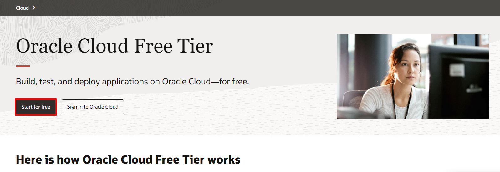


> <span style="background-color:#FFCCCC; color:#D33E43;"><strong>❗ATENÇÃO❗</strong></span><br><br>
> <font color=#D33E43> Utilize o e-mail cadastrado no evento para o processo de criação da conta Free Trial.</font> <br>

Preencha com as informações do **País, Nome e Sobrenome, e Email**. Em seguida, clique em **Verify my Email**

   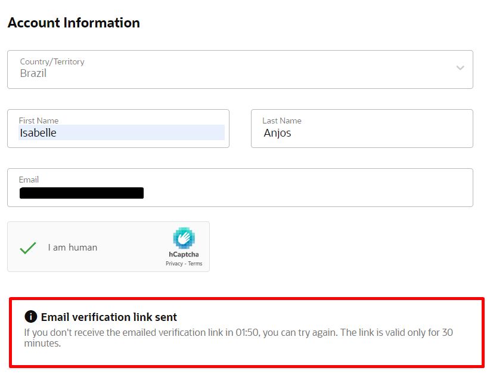

Ao clicar em Verify my Email, a seguinte mensagem irá aparecer em sua tela. Selecione **Select Offer**

   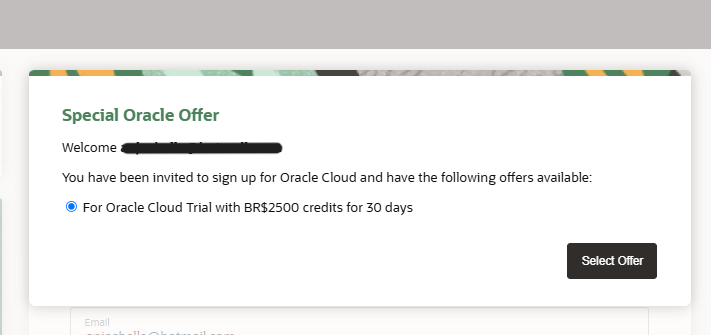

## 2️⃣ Ativação da Conta

Você receberá um e-mail semelhante ao exemplo abaixo. **Caso não encontre, verifique se ele não está na pasta de spam**. Em seguida, clique em **"Verify Email"** para continuar:

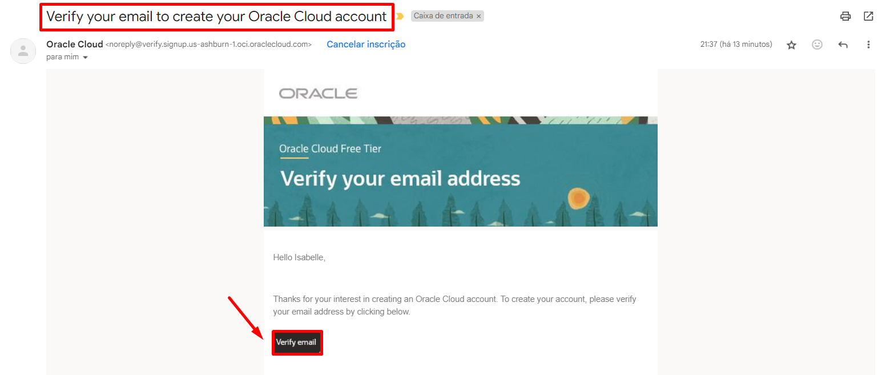

> <span style="background-color:#FFCCCC; color:#D33E43;"><strong>❗ATENÇÃO❗</strong></span><br><br>
> <font color=#D33E43> Conclua os passos a seguir em **até 30 minutos** para evitar que o link enviado por e-mail seja reiniciado. **Evite clicar no link mais de uma vez**, pois isso poderá gerar uma mensagem de erro.</font> <br>
> 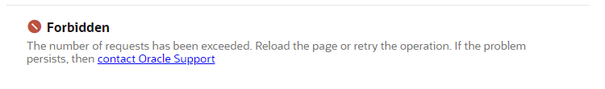

Em seguida, crie uma senha que atenda às seguintes regras:
   - A senha deve ter no mínimo **8 caracteres**, incluindo **1 letra minúscula**, **1 letra maiúscula**, **1 número** e **1 caractere especial**.
   - A senha não pode ter mais de **40 caracteres**, nem conter o **nome**, **sobrenome**, **endereço de e-mail**, **espaços** ou os caracteres: ``` ` ~ < > \ ```.

   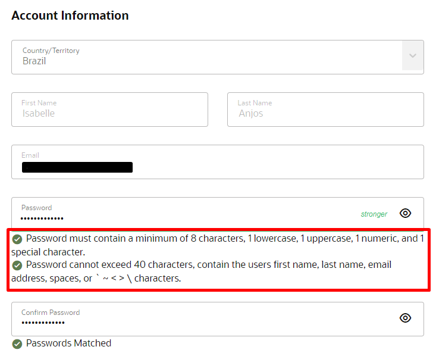

Selecione as opções indicadas abaixo:

- **Tipo de Cliente**:
     - Selecione a opção **Individual**.

- **Home Region**:
    - **Selecione a opção "US Midwest (Chicago)"** como a região de origem. 

- **Confirmação da Região**:
    - Marque a caixa de seleção para confirmar que entende que a **região de origem** não pode ser modificada após este passo.
  
- **Termos de Uso**:
    - Leia os Termos de Uso e clique em **Continue** para prosseguir com a configuração da conta.

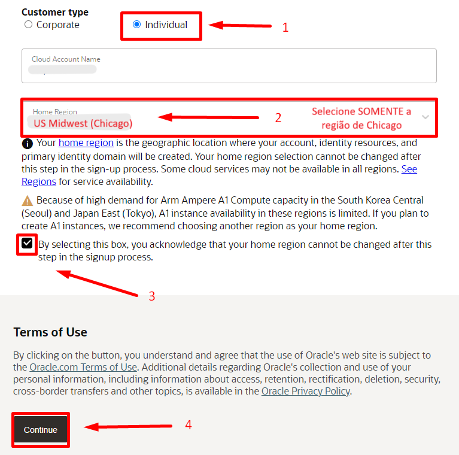

Preencha as informações de endereço. Após preencher todos os campos, clique em **Continue** para prosseguir.

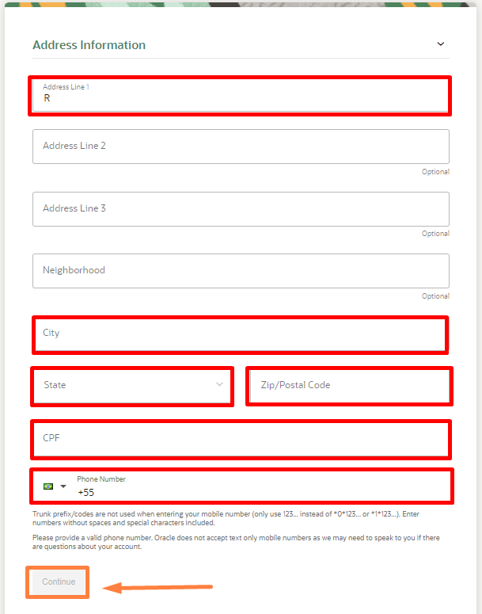


1. Marque a caixa de **Agreement** para concordar com os termos.
2. Clique em **Start my free trial** para iniciar seu período de teste gratuito.

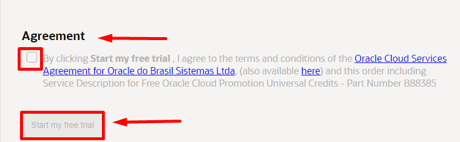

## 3️⃣ Configuração da Autenticação de Dois Fatores

Após iniciar o Free Trial, aguarde enquanto a Oracle configura sua conta. A mensagem **"Please wait while we finish setting up your account"** aparecerá na tela. Esse processo pode levar alguns minutos.

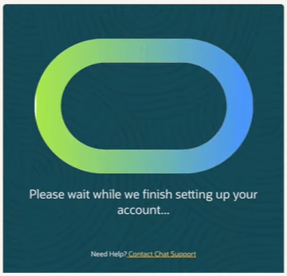

1. Você receberá um e-mail de confirmação da Oracle com o título **"Get Started Now with Oracle Cloud"**.
2. Neste e-mail, localize o **Cloud Account** e o **Username**, que serão necessários para acessar sua conta na nuvem.

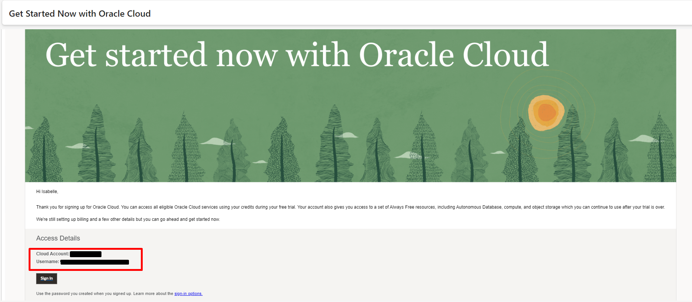

3. Acesse a página de login da Oracle Cloud através do link [www.oracle.com/br/cloud/sign-in.html](https://www.oracle.com/br/cloud/sign-in.html)
4. Insira o **Cloud Account** fornecido no e-mail de confirmação.
5. Clique em **Próximo** e siga as instruções para finalizar o login.

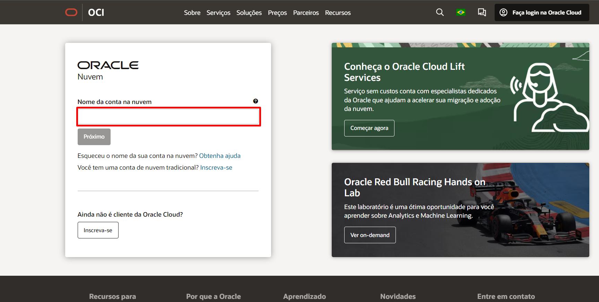

Na tela seguinte, clique em **Enable Secure Verification** para iniciar a configuração da verificação em duas etapas.

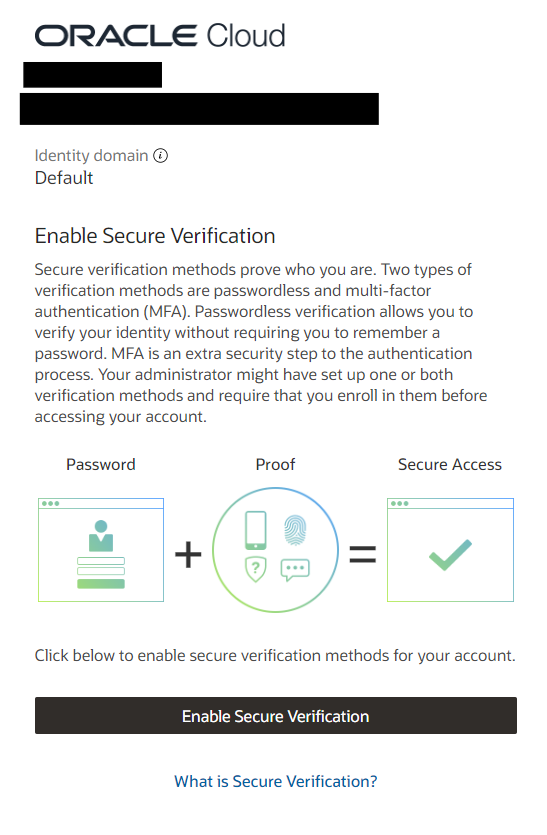

Selecione o método de autenticação **Mobile App** e busque por **Oracle Mobile Authenticator** na loja de aplicativos do seu celular.
   - [Link para Android](https://play.google.com/store/apps/details?id=oracle.idm.mobile.authenticator&hl=pt_BR&pli=1)
   - [Link para Iphone](https://apps.apple.com/br/app/oracle-mobile-authenticator/id835904829)

Configure o aplicativo de autenticação:
   - Abra o aplicativo no seu dispositivo móvel.
   - Toque em **Add Account ou +** e escaneie o código QR exibido na tela para vincular o aplicativo à sua conta.

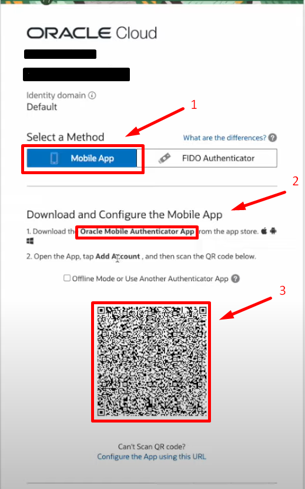

Conclua o processo de configuração:
   - Após o aplicativo ser vinculado, você verá uma confirmação na tela com a mensagem **Successfully Enrolled**.
   - Clique em **Done** para finalizar o processo.

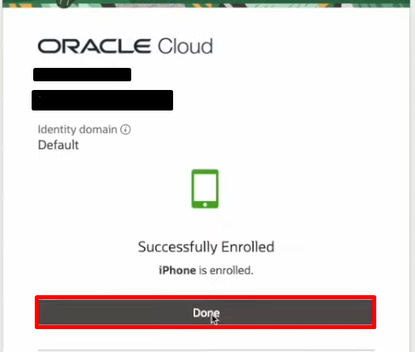

## 4️⃣ Acesso à conta

Após realizar o processo de configuração de dois fatores você será direcionado para a tela de login. Insira seu **e-mail** e **senha** cadastrados, em seguida, clique em **Sign In** para prosseguir.

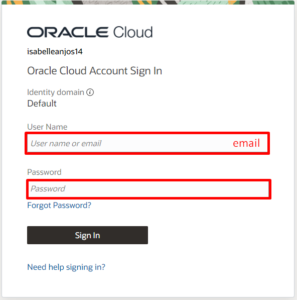

Você receberá uma **notificação** no dispositivo configurado com o **Oracle Mobile Authenticator**. Abra a notificação e toque em **Allow** para continuar o login.

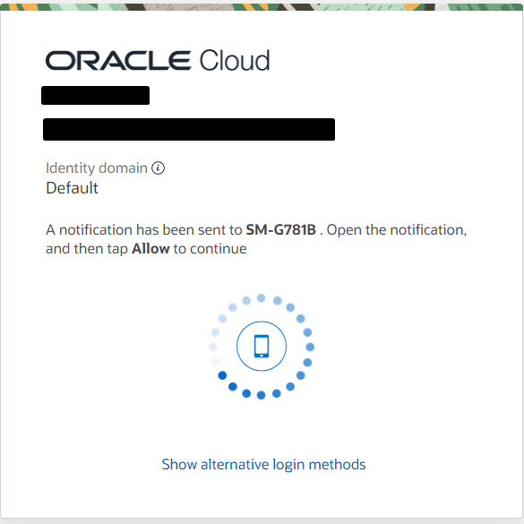

Após o login, você será redirecionado para o painel da Oracle Cloud.
  - Verifique se a **região selecionada** no canto superior direito é "US Midwest (Chicago)"
  - No painel, você pode visualizar seus créditos restantes e acessar os links para os serviços.

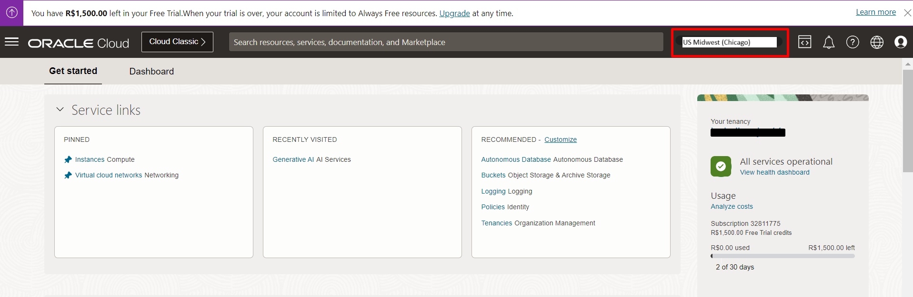


## 5️⃣ Sumário

Com sua conta Oracle Cloud Free Tier configurada, agora você pode prosseguir com qualquer laboratório técnico na OCI. **Explore ao máximo seus créditos gratuitos para descobrir tudo o que a Oracle Cloud tem a oferecer!**

## 👥 Agradecimentos

- **Autores** - Caio Oliveira
- **Autor Contribuinte** - Isabelle Anjos
- **Última Atualização Por/Data** - Outubro 2024

## 🛡️ Declaração de Porto Seguro (Safe Harbor)

O tutorial apresentado tem como objetivo traçar a orientação dos nossos produtos em geral. É destinado somente a fins informativos e não pode ser incorporado a um contrato. Ele não representa um compromisso de entrega de qualquer tipo de material, código ou funcionalidade e não deve ser considerado em decisões de compra. O desenvolvimento, a liberação, a data de disponibilidade e a precificação de quaisquer funcionalidades ou recursos descritos para produtos da Oracle estão sujeitos a mudanças e são de critério exclusivo da Oracle Corporation.

Esta é a tradução de uma apresentação em inglês preparada para a sede da Oracle nos Estados Unidos. A tradução é realizada como cortesia e não está isenta de erros. Os recursos e funcionalidades podem não estar disponíveis em todos os países e idiomas. Caso tenha dúvidas, entre em contato com o representante de vendas da Oracle. 


